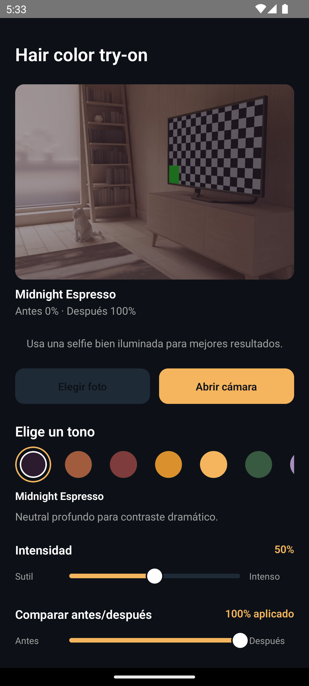

# Color Me — Repository Overview

## Overview
This repo (Express BFF, FastAPI ML API, and React Native Android) powers the mobile-first **hair color try-on** experience and will later support prosthetic hair features. `CLAUDE.md` spells out requirements (10-color palette, intensity slider, before/after view, sharing, CTA), and `PROJECT_PLAN.md` / `TICKETS.md` provide the MVP/V1 roadmap.

## Structure
- `apps/mobile/`: React Native Android (screens, services, utilities).
- `services/bff/`: Express TypeScript gateway (validation, rate limiting, error mapping).
- `services/ml-api/`: FastAPI pipeline (segmentation, recolor, cached model loading).
- `docs/`: Spec docs (palette, payloads, UX copy, plans/tickets).
- `scripts/verify.sh`: Verification script (ruff/mypy/pytest for ML, npm lint/tests for BFF/mobile where applicable).

Currently `apps/` and `services/` are fleshed out as the architecture evolves. Use this repository to version all work and record every addition in `docs/`.

## Mobile App

### Running on Android Emulator
```bash
cd apps/mobile
npm install
npm run android
```

The app will build, install, and launch on the connected emulator/device.

### Screenshots


## Commands
- `make dev`: boots the stack (once `Makefile`s are in place).
- `make lint`: runs linters repository-wide.
- `make test`: runs available test suites.
- `npm run dev`, `npm test`: under `services/bff`.
- `uvicorn app.main:app --reload`, `pytest`: under `services/ml-api`.
- `npm run android`: under `apps/mobile`.
- `scripts/verify.sh`: checks repository health; run after adding dependencies/packages.

If a folder/log/command does not yet exist, document why in `docs/` and update `AGENTS.md`/`PROJECT_PLAN.md` before breaking the workflow.
